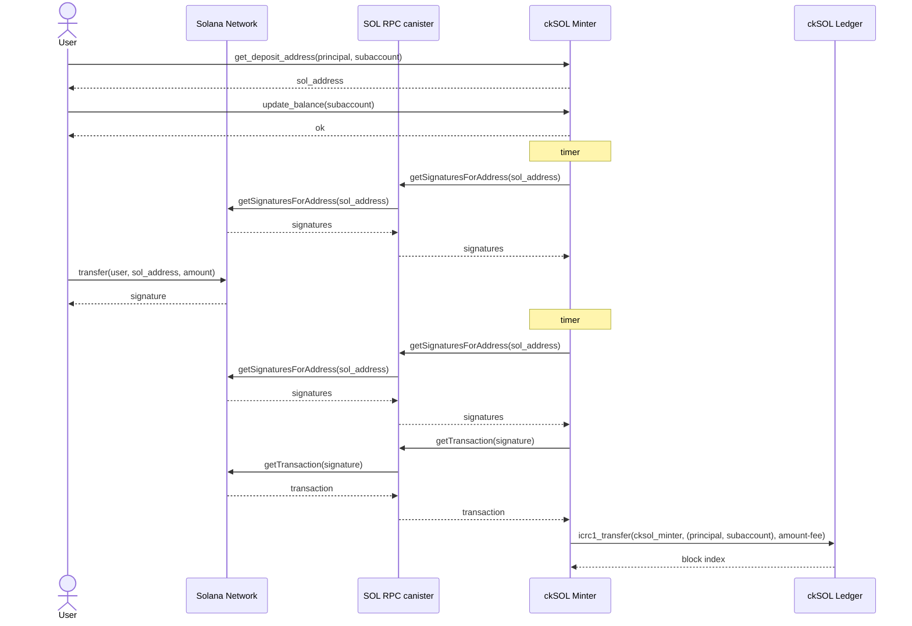
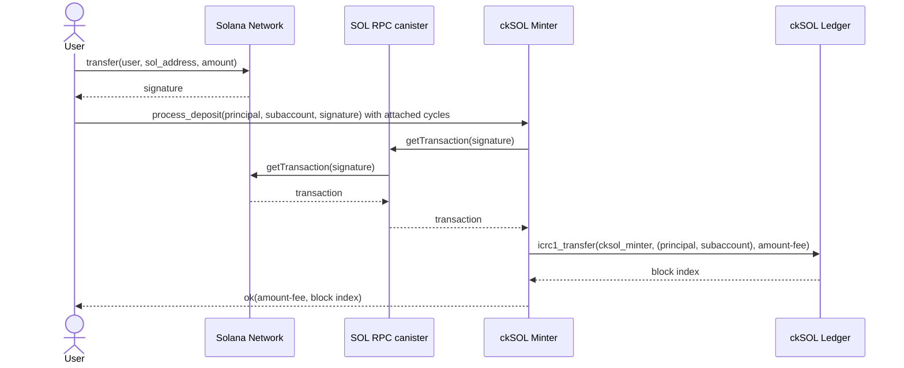
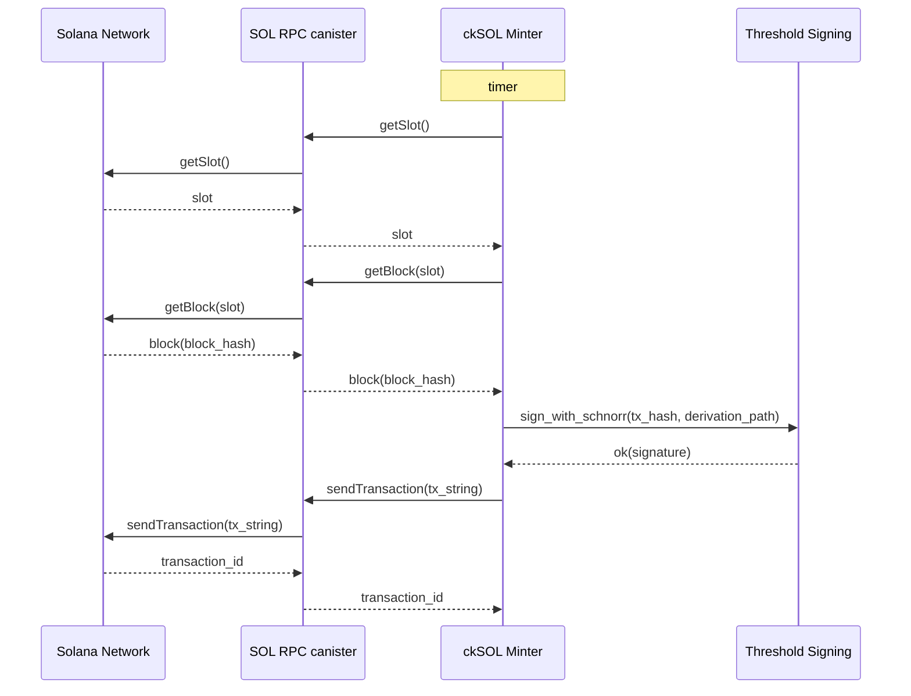
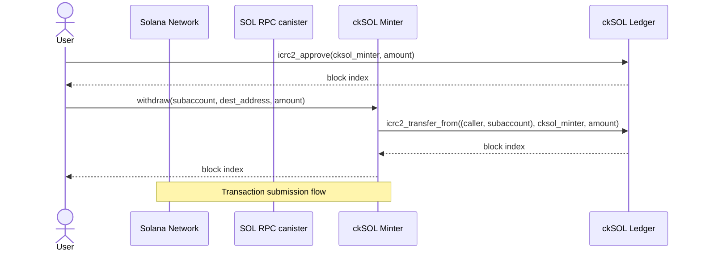
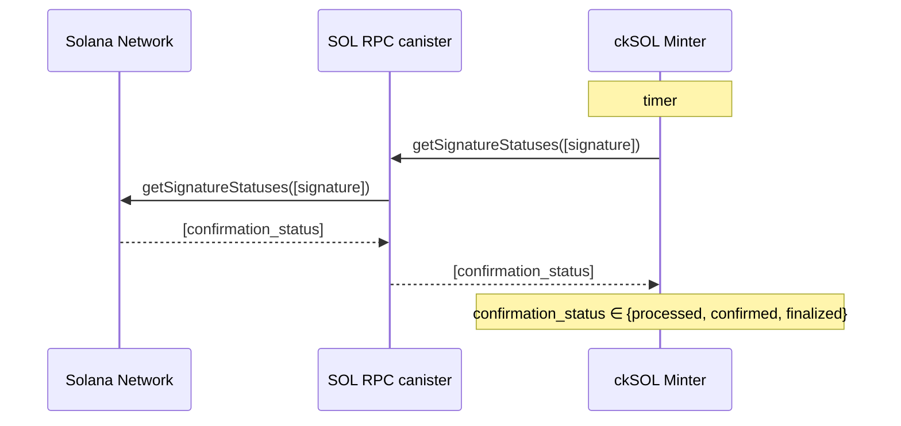
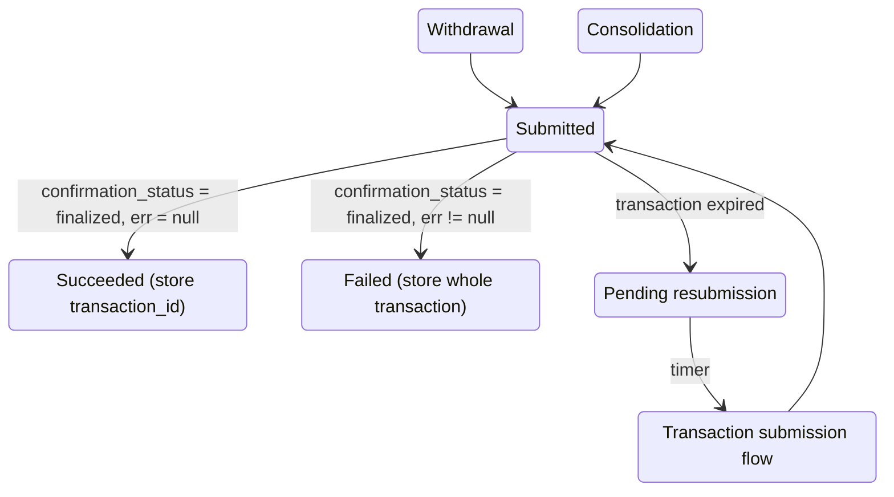

# Chain-Key SOL (ckSOL) - Architecture

## 1. Overview

Chain-key SOL (**ckSOL**) is an ICRC-2 (and ICRC-3) compliant token on the Internet Computer that is backed 1:1 by SOL, the primary token on the Solana blockchain. Users can convert their SOL tokens to ckSOL and vice versa.

The ckSOL functionality is provided through a new canister (**ckSOL minter**) together with an instance of the ICRC ledger suite, in particular a ledger canister (**ckSOL ledger**), and an index canister. The ckSOL minter *default account* is the *minting account* of the ckSOL ledger.

The ckSOL minter is the canister responsible for managing deposited SOL and minting/burning ckSOL. Concretely, it provides the following functionality:

* **Mint**: If a user transfers SOL to a specific account under the ckSOL minter’s control, the ckSOL minter can instruct the ckSOL ledger to mint ckSOL for the user, owned by a given ICRC account (principal ID-subaccount pair).  
* **Burn**: After granting the ckSOL minter access to some of the user’s funds, the user can request a withdrawal of SOL to be sent to a user-provided destination address. The funds are sent out after instructing the ckSOL ledger to burn the requested amount of ckSOL tokens.

Both operations, as well as the transfer of ckSOL, incur a fee as specified in Section 2.3.

The general model is that the ckSOL minter needs to receive SOL *before* it mints ckSOL and it burns ckSOL *before* it transfers SOL back to the users in order to ensure that the total supply of ckSOL is always upper bounded by the amount of SOL held by the ckSOL minter.

In addition to performing the mint and burn transactions, the ckSOL ledger is responsible for keeping account balances and for transferring ckSOL between accounts. As mentioned before, the ckSOL ledger must be ICRC-1, ICRC-2, and ICRC-3 compliant. As the ckSOL ledger is a standard ICRC ledger, the following sections are concerned with the design of the ckSOL minter.

## 2\. Technical Details

The ckSOL minter interacts with the Solana blockchain via the [SOL RPC canister](https://github.com/dfinity/sol-rpc-canister). The ckSOL minter uses the following subset of endpoints:

* [getBlock](https://solana.com/docs/rpc/http/getblock): Returns the block for the given slot. This function is used to get a recent block hash, which is contained in the response. Note that `transactionDetails` is set to `null` in the request. As a result, signatures and transactions are not returned.  
* [getSignaturesForAddress](https://solana.com/docs/rpc/http/getsignaturesforaddress): Returns the signatures for a given address. This function is used to learn about new transactions (in Solana, signatures are used to identify transactions as the first signature in a transaction is considered the transaction ID).  
* [getSignatureStatuses](https://solana.com/docs/rpc/http/getsignaturestatuses): Returns the status of each transaction specified through its identifier, i.e., the first signature in the transaction. This function is used to determine whether or not a transaction has been finalized or needs to be resubmitted.  
* [getSlot](https://solana.com/docs/rpc/http/getslot): Returns the current slot. Since the slot number changes rapidly, the SOL RPC canister returns only a rounded and therefore slightly outdated slot number. The slot number is required to obtain a recent block hash using `getBlock`. Moreover, `getSlot` is used to check if an unconfirmed transaction has expired.  
* [getTransaction](https://solana.com/docs/rpc/http/gettransaction): Returns the whole transaction for the given signature.  
* [sendTransaction](https://solana.com/docs/rpc/http/sendtransaction): Sends out the provided transaction. It requires the execution of the functions `getSlot` and `getBlock` to obtain a recent block hash, which must be part of the transaction.

### 2.1. Converting SOL to ckSOL

The process of converting SOL to ckSOL should be as simple as possible for the user, or more generally for any frontend that offers this functionality. It should further be possible to convert SOL held on centralized exchanges straight to ckSOL. While SOL transfers can bear a memo, which would make it possible to use the same destination address, controlled by the ckSOL minter, for all conversions, most popular centralized exchanges do not offer the option to specify a memo, making a direct transfer to a single address infeasible as the ckSOL minter could not determine the ICRC account (principal ID plus subaccount) that should be credited for received funds.

The chosen approach is to derive a **deposit address** for a given ICRC account: The user calls the endpoint `get_deposit_address` with a principal ID and subaccount as parameters on the ckSOL minter and receives a derived SOL address in return. Note that the SOL address is derived deterministically, i.e., always the same address is returned for the same principal ID and subaccount. Since it is a deterministic function, other pieces of software, such as frontends or other canisters, can derive deposit addresses themselves instead of querying the ckSOL minter.

Concretely, the deposit address is the ckSOL minter’s address with the user’s account (principal ID and subaccount) used [as the derivation path](https://github.com/dfinity/ic/blob/215615d2d08f2679126fbe074bbff2e1bf3064dc/rs/bitcoin/ckbtc/minter/src/address.rs#L102), i.e., effectively the same mechanism as for [ckBTC](https://learn.internetcomputer.org/hc/en-us/articles/44598021228564-Chain-key-Bitcoin) is used to generate a user-specific address. The user can then transfer the desired amount to this address. Two separate deposit flows are supported, which are introduced next.

#### 2.1.1. Validating a Solana Deposit Transaction

An example of a Solana deposit address is given [here](EXAMPLE_TRANSACTION.md).

The ckSOL minter processes such a transaction as follows. The involved addresses are extracted, which are the `pubkey` fields under `transaction.message.accountKeys`. Additionally, the `preBalances` and `postBalances` are read to see how much was transferred to the individual addresses affected by this transaction. This data must be identical across the various responses from the RPC providers but the validation covers the whole transaction for the sake of simplicity.

This list is then used to derive the transferred amounts to and from each of the involved addresses, corresponding to the differences between the post- and pre-balances. The ckSOL minter will then search for the addresses of interest in this list, read the transferred amount, and take action accordingly.

#### 2.1.2. Automated Flow

When a user calls the endpoint `update_balance`, the ckSOL minter will check transfers to the deposit address derived for the caller’s principal ID and the provided subaccount (if any) on a timer by calling the `getSignaturesForAddress` endpoint on the SOL RPC canister, filtering out failed transactions (based on the `err` field in the response). If previously unknown (finalized) signatures are returned, the ckSOL minter will call the `getTransaction` endpoint for the newly obtained signatures. The transaction data contains information about the transferred amount, which will then be minted, minus a certain fee (defined in Section 2.3.2.), on the ckSOL ledger using an `icrc1_transfer` call, crediting the user’s account.

The user must transfer at least the **minimum deposit amount**, defined in Section 2.3.3. Any deposit below this amount is ignored.

The returned transaction can contain SOL transfers as *top-level instructions*, i.e., the transaction (message) instructions contain instructions of type “transfer” for program “system”. Alternatively, SOL transfers can be made via *inner instructions*, i.e., the transfer happens through a cross-program invocation (CPI). Such transfers can be extracted from the “meta” data of the transaction. The implementation must capture transfers of both types.

> **_NOTE:_** Some transfers are not captured, e.g., transfers via the [CloseAccount](https://solana.com/docs/tokens/basics/close-account) instruction. The fact that there are corner cases where no mint occurs is accepted for now and will be addressed at a later stage.

The flow is depicted in the following figure (`fee` refers to the deposit fee).  



The user’s account is cached, together with the derived Solana address, so that the function called on a timer to check for newly arrived funds can access the required information. The timer mechanism works as follows. After an initial waiting time, the timer executes for the first time.

The following scheme is proposed to bound the number of timer invocations per deposit address. At most `MAX_GET_SIGNATURES_CALLS` **= 10 calls** are made with the interval between calls doubling from **1, 2, 4, 8, 16, 32, 64, 128, 256, up to 512 minutes** for a total of **1023 minutes**, i.e., slightly more than 17 hours. The timer is not set anymore whenever a call returns at least one new signature that results in a mint operation.

In order to mitigate the risk of a denial-of-service attack, each account has a certain **quota** for the automatic flow, which consists of a quota for `getSignaturesForAddress` calls and a quota for `getTransaction` calls. Initially, the quotas are `MAX_GET_SIGNATURES_CALLS` and `MAX_TRANSACTIONS_PER_ACCOUNT`, respectively. Calls of either type are only made if there is a positive remaining quota.

Since each IC account gets a newly derived deposit address, these addresses are likely involved in deposits only, i.e., there should not be many `getTransaction` calls in vain in the common case. Whenever there is a successful call that results in a mint, both quotas are increased by 2 for the following reason: They are both bumped by 1 so that calls that result in a mint do not count against the quotas. The additional bump of each quota serves to ensure that an occasional call that does not result in a mint operation does not slowly drain the free quota. Note that RPC calls may sporadically fail for various reasons such as network issues or RPC providers being unavailable. There is a ceiling of `MAX_GET_SIGNATURES_CALLS` and `MAX_TRANSACTIONS_PER_ACCOUNT` for the `getSignaturesForAddress` quota and the `getTransaction` quota, respectively.  
The mechanism to replenish a depleted quota is discussed in the next section.

The quota is meant as a deterrent but does not stop an attacker from triggering many `getTransaction` calls for different addresses. In order to limit the impact of such an attack, the constant `MAX_MONITORED_ACCOUNTS` specifies the global limit on the number of addresses for which automatic deposits are allowed at any given time. This constant also limits the memory consumption. Furthermore, `update_balance` only takes a subaccount parameter, i.e., it is not possible to call the function for other principals, preventing drainage attacks against the quotas of other users.

If a returned transaction contains one or more transfers to the user’s deposit address, the sum of the transferred amounts, minus a fee, is minted in a *single* `icrc1_transfer` call to the ckSOL ledger. As mentioned before, no ckSOL is minted if the amount is below the minimum deposit amount.

The ckSOL minter must keep track of the covered range for each address for the sake of performance. Unfortunately, the `getSignaturesForAddress` endpoint does not allow a forward search starting from some transaction signature. Therefore, for each address that has ever been tracked, the covered range must be maintained. If an `update_balance` call is made and both quotas are positive, the following steps are executed.

```
// Initially max_parsed = ⊥, gap_upper = gap_lower = genesis_sig
// limit = MAX_TRANSACTIONS_PER_ACCOUNT
if gap_upper = gap_lower:
    [s_1,...,s_n] := getSignaturesForAddress(limit, until=gap_upper)
    if n < limit:    // All signatures have been returned in the range
        max := s_1, gap_upper := max, gap_lower := max
    else:    // There might be a gap between s_n and gap_lower
        max := s_1, gap_upper := s_n
else:    // The gap between gap_upper and gap_lower must be closed
    [s_1,...,s_n] := getSignaturesForAddress(limit, before=gap_upper, until=gap_lower)
    if n < limit:	// All signatures have been returned in the range
        gap_upper := max, gap_lower := max
    else:    // The gap has been reduced but may not be closed yet
        gap_upper := s_n
process(s_1,...,s_n)
```

The idea is to cover the whole range since genesis. Assuming that the latest transaction signature that has ever been returned in previous calls is `max`, if reading from the current block returns `MAX_TRANSACTIONS_PER_ACCOUNT` transactions, it is unclear whether there are more transaction signatures between the oldest returned transaction and `max`. In subsequent calls, the algorithm above closes this gap before requesting transaction signatures that are more recent than `max`.

> **_NOTE:_** It is possible that an address appears in many transactions that do not change the balance of the account. If there are more than `MAX_TRANSACTIONS_PER_ACCOUNT` such transactions, the quota can be exhausted before a valid deposit is discovered. Deposits can always be processed using the manual flow but the automatic flow may not work until all past transactions for this address have been processed. This risk is currently accepted.

> **_NOTE:_** There may be only one active timer per deposit address at any time across all endpoints that interact with the deposit address.

Since tracking stops when a deposit is discovered, the question is how transaction signatures are treated that have been obtained via `getSignaturesForAddress` calls but have not been requested and processed. A related question is how `getTransaction` calls are scheduled if there are multiple tracked addresses with outstanding `getTransaction` calls. The ckSOL minter treats the problem of deciding which transactions to query and which transactions to request next separately. The mechanism outlined above decides which transactions are to be queried next. These are put into a map with the account as the key and the value being a queue of transaction signatures, corresponding to the transactions to be obtained and checked next. Whereas the mechanism above adds transaction signatures to the map, the ckSOL minter iterates over the monitored accounts in insertion order and collects signatures to check in a round-robin fashion. Once tracking of an account stops, the corresponding entry in the map is removed.

HTTPS outcalls are a scarce resource. Therefore, the number of in-flight requests should be bounded, never having more than `MAX_IN_FLIGHT_SOL_RPC_CANISTER_CALLS` open calls to the SOL RPC canister at any time. Requests on a timer are only scheduled if there is capacity for another call.

Proposed values for the parameters are provided in this list:

* `MAX_TRANSACTIONS_PER_ACCOUNT`: This constant is the product of the number of transaction requests that can be packed into a JSON batch request and the maximum number of `getTransaction` calls that the ckSOL minter may make for a single `get_deposit_address` call. Batching is not yet available, so currently the only parameter is the number of transaction requests, which can initially be set to **50**.  
* `MAX_MONITORED_ACCOUNTS`: The number of monitored addresses must be upper bounded as well. Since HTTPS outcalls are protected by imposing an upper bound on the number of in-flight outcalls and an address does not take up too much space, a fairly large number of addresses could be monitored. The reason to keep this number on the small side is that a cycle drainage attack could be launched by having the ckSOL minter spend many cycles monitoring a large number of addresses. A compromise would be to set the parameter to a conservatively low value of **100** initially.  
* `MAX_IN_FLIGHT_SOL_RPC_CANISTER_CALLS`: The maximum number of in-flight calls to the SOL RPC canister. The suggested parameter is **10**.

#### 2.1.3. Manual Flow
   
A user may issue a request to retrieve a particular transaction and mint ckSOL based on that transaction manually. This manual flow serves two purposes: First, it enables a user to get ckSOL more quickly as there is no initial waiting time. Second, if the `update_balance` call exhausted the quota, the manual flow can be used to retrieve the transaction corresponding to a SOL transfer to the deposit address, which will then result in the minting of ckSOL, and replenish the quota of the deposit address for future automatic lookups.

The manual flow is depicted in the following figure.  



The manual flow is triggered by calling `process_deposit` with the user’s account (principal ID and subaccount) and the signature identifying the transaction as parameters. This endpoint requires cycles to be attached. As specified in Section 2.3.2., **1T cycles** must be attached to the call.

After accepting the cycles, the ckSOL minter first checks if it already stores the corresponding transaction information: the amount to be minted, i.e., the sum of amounts minus the *manual deposit fee* (defined in Section 2.3.2.), the transaction signature, and the user’s account, and the boolean flag `completed`. If `completed`, nothing remains to be done and the call returns. If there is a record of this transaction but `completed=false`, then the call to the SOL RPC canister is skipped. Otherwise, the call is made to obtain the transaction details. If the obtained transaction details indicate that a transfer has been made to the user’s deposit address, the transaction information is recorded with the flag `completed=false`. The ckSOL minter then triggers the minting by calling the `icrc1_transfer` endpoint on the ckSOL ledger. When the mint operation is complete, the ckSOL minter updates the corresponding flag to `completed:=true` and returns the amount minted plus the block index corresponding to the mint operation on the ckSOL ledger.

Inter-canister calls may fail, specifically the calls to the SOL RPC canister and the ckSOL ledger.  In either case, an error is returned and no further action is taken.

The cycles are mainly intended to pay for the calls to the SOL RPC canister, including any calls due to the automatic deposit flow. The 1T cycles are sent to the SOL RPC canister to obtain the transaction whose hash is specified in the `process_deposit` call. From the returned amount of cycles, additional cycles are deducted:

1. **26.2B cycles** are deducted if there was a mint operation, which is the cost of obtaining a [threshold signature on a 34-node subnet](https://docs.internetcomputer.org/references/t-sigs-how-it-works/). These cycles are used to pay for the consolidation process described in the next section.  
2.  **100M cycles** are subtracted otherwise for the work carried out by the ckSOL minter.

Let `x`T cycles denote the left-over cycles. As shown in Section 2.3.2., depleting the quotas consumes roughly 0.44T cycles. Given that `x` is at least 0.9738, there are enough cycles to replenish both quotas, i.e., after this operation, both quotas are again at their respective maximum values.  
The cost of replenishing the number of allowed `getSignaturesForAddress` calls from `y` to `MAX_GET_SIGNATURES_CALLS` is `(MAX_GET_SIGNATURES_CALLS-y)*5` G cycles (rounding up the derived cost of 4.3G). Similarly, the cost of replenishing the number of allowed `getTransaction` calls from `z` to `MAX_TRANSACTIONS_PER_ACCOUNT` is `(MAX_TRANSACTIONS_PER_ACCOUNT-z)*8` G cycles (rounding up the derived cost of 7.5G).  
Given the suggested parameters, the cost is at most 0.45T cycles. Thus, at least 0.5238T cycles are refunded.

#### 2.1.4. Consolidation

Since users deposit funds in dedicated deposit addresses, the ckSOL minter’s funds are spread across multiple addresses, making withdrawals inconvenient. Therefore, a consolidation mechanism is introduced that transfers the funds from deposit addresses to the main address of the ckSOL minter. The general flow for submitting a transaction is shown in the following figure.  



All transactions are created on a timer. Since a transaction must contain a recent block hash, such a block hash must be obtained first: A `getSlot` call is used to get a recent slot, followed by a `getBlock` call to retrieve block details, in particular the block hash, for the slot received in the first step. Note that it is possible that there is no block for a certain slot, in which case `getSlot` needs to be called again, followed by another call to `getBlock`. The figure only shows the happy path of one call each. Given a recent block hash, the transaction is built, obtaining an EDDSA signature for each transfer to be made within that transaction. Once the transaction is signed and serialized, it is sent to the SOL RPC canister, which forwards it to the RPC providers.

A timer is run periodically, triggering the consolidation. It is likely sufficient to invoke the consolidation at a low frequency, such as once every 10 minutes. A single SOL transfer requires roughly 70-90 bytes in a transaction. Since the maximum transaction size is 1232 bytes, up to approximately **10 consolidation transfers** per transaction are possible. Whenever the timer executes and there is *any* unconsolidated address, then consolidation transactions are created and issued, with up to 10 transfers per transaction, until *all* deposits have been consolidated. Multiple transactions can be batched in a single HTTPS outcall.

A concrete mainnet example of a transaction that makes two transfers to the same destination address can be viewed [here](https://solscan.io/tx/5CzNKyQsSfAtCQAxnj6acuhQZEh5J4B8aZzV1ArvvM8vodUr4vcQu7Co8wzbHrSYMW4h8ikg67bqCZSU4AHiL1D9).

Note that the default compute unit (CU) limits are [200,000 CUs per instruction and 1,400,000 per transaction](https://solana.com/hi/docs/core/fees/compute-budget). A standard transfer consumes around [300 CUs](https://research.topledger.xyz/blogs/compute-units-and-transaction-bytes-on-solana), well below the instruction limit. Moreover, 10 transfers together is still clearly below the transaction limit. In short, there is no need to bump the *compute allocation* for such transactions. The transaction fee only depends on the number of signatures. If there are `k ≤ 10` signatures, one signature for each consolidation transfer, where the first signer is the fee payer, the fee is `5000*k` lamports. The address whose funds are moved in the first transfer instruction pays the transaction fee.

### 2.2. Converting ckSOL to SOL

#### 2.2.1. Submitting Withdrawal Requests

Converting ckSOL back to SOL requires two user actions: The user must approve the ckSOL minter to withdraw from his/her ckSOL account by calling `icrc2_approve` and then call `withdraw`. Naturally, the user may approve the ckSOL minter to withdraw a large amount from his/her account so that multiple `withdraw` calls can be performed without the need to create new approvals.

The `withdraw` endpoint has the following parameters: An optional subaccount, the destination address on Solana, and the amount to be withdrawn. When receiving such a request, the ckSOL minter issues an `icrc2_transfer_from` call, sending the requested amount from the account corresponding to the caller’s principal ID plus the provided subaccount (if any) to its own account. Since its account is the minting account, this transfer is a burn operation, burning the given amount.  
If this burn operation is successful, the retrieval request is added to an internal queue and the block index of the burn operation is returned to the user. Otherwise, an error is returned.

When the timer strikes, up to 10 retrieval requests are batched into a single transaction and sent to the SOL RPC canister. The flow is shown in the following figure, using the transaction submission flow defined above.  



Since Solana has a high block rate, the timer should execute more frequently compared to ckBTC. The proposed interval is **10 seconds**. A shorter interval between calls implies that there is a lower chance of retrieval requests being batched together; however, it is preferable to have smaller batches as transactions are cheap and it provides a better user experience.

There is a **minimum withdrawal amount**, which is defined in Section 2.3.2.

The funds for each withdrawal are taken from the main account. It is possible that the main account does not have sufficient funds because there are large deposits that have not been consolidated yet. If the ckSOL minter does not have sufficient funds to carry out a withdrawal, it triggers the consolidation process so that the withdrawal(s) can go through as soon as the consolidation transaction has been finalized.

#### 2.2.2. Finalization and Resubmissions

The statuses of (consolidation or withdrawal) transactions are checked on a timer by calling the `getSignatureStatuses` endpoint on the SOL RPC canister. The status of any accepted transaction is either `processed`, `confirmed`, or `finalized`.



It is possible that a transaction is not accepted, i.e., it is not found in any of the statuses listed above. Since ckSOL tokens are not reimbursed, the transaction must be resubmitted until it is confirmed; however, care has to be taken to ensure that there is no double spending. Solana transactions refer to a recent block hash. The block hash may not be more than 150 blocks in the past, which corresponds to roughly 90 seconds.

If there are transactions that are not found after 150 blocks, i.e., they did not even reach the status `processed`, they need to be resubmitted. The different states and their transitions internal to the ckSOL minter are shown in the following figure.


 
The withdrawal and consolidation flows result in the submission of a transaction, which is then in the `Submitted` state. The status of submitted transactions is checked on a timer as outlined above. If a transaction reaches the confirmation status `finalized`, there are two cases: If the transaction was finalized successfully, i.e., without errors, the transaction transitions to the state `Succeeded` and its ID is stored permanently. If there was an error, the transaction transitions to the state `Failed` and is stored in its entirety so that it can be analyzed what happened. Ideally, no transaction ever ends up in this state. However, it is possible for transactions to fail, for example by attempting to withdraw SOL to a program account, which is not allowed. As there is no reimbursement flow, the user’s funds would be stuck in this case. Storing the whole failed transaction ensures that the funds are not lost and appropriate actions may be taken when such transactions are encountered.

If the transaction expires, i.e., it is unknown after 150 blocks, it enters the `Pending resubmission` state. A different timer fetches transactions from this state, following the transaction submission flow to submit it again, at which point the transaction is back in the `Submitted` state.

A prioritization fee is not required under normal load, therefore it is omitted. If the need arises to bump fees, this topic will be revisited.

### 2.3. Fees & Minimum Swap Amounts

#### 2.3.1. ckSOL Ledger Fees

**Summary**:

* ckSOL transfer fee: 0.0000005 SOL (500 lamports)

A SOL or SPL token transfer costs 0.000005 SOL \= 5000 lamports, which corresponds to 0.0005 USD at 1 SOL \= 100 USD.  
Executing a token transfer on an ICRC ledger consumes roughly 1.2m cycles on a 13-node subnet, which corresponds to 3.14m cycles on a 34-node subnet such as the fiduciary subnet.  
This cycles cost corresponds to 3.14\*10^-6 XDR \= 4.5216\*10^-6 USD \= 4.5216\*10^-8 SOL \= 45.2 lamports. As there are additional costs such as maintaining the index canister, the fee is set to **500 lamports**, which is one order of magnitude cheaper than a SOL transfer on Solana.

#### 2.3.2. ckSOL Minter Fees

**Summary**:

* Automatic deposit fee: 0.01 SOL  
* Manual deposit fee: 0.00001 SOL  
* Withdrawal fee: 0.001 SOL

The ckSOL minter charges fees for the deposit and withdrawal of SOL, which imply lower bounds on the minimum deposit and retrieval amounts.  
The fees must be large enough to cover the cost of the required calls to the SOL RPC canister and the threshold-Schnorr API.

The response size affects the cost of HTTPS outcalls. The relevant RPC endpoints were each called 1000 times for randomly chosen transactions.  
The maximum response sizes for each endpoint are listed here:

* `getSignaturesForAddress`: 11,793 bytes (with a limit of 50 signatures)  
* `getTransaction`: 31,985 bytes  
* `getSignatureStatuses`: 275 (1 sig.), 1784 (10 sig.), 14868 (100 sig.) bytes  
* `getBlock`: 232 bytes  
* `sendTransaction`: 128 bytes  
* `getSlot`: 44 bytes

The following maximum response sizes were used to determine the cycles costs of the individual endpoints:

* `getSignaturesForAddress`: 20,000 bytes  
* `getTransaction`: 50,000 bytes  
* `getSignatureStatuses`: 200\*(1+\#signatures) bytes  
* `getBlock`: 500 bytes  
* `sendTransaction`: 250 bytes  
* `getSlot`: 100 bytes

Using the [cost estimation endpoints](https://dashboard.internetcomputer.org/canister/tghme-zyaaa-aaaar-qarca-cai) of the SOL RPC canister, the following estimates are computed for the cycles cost of each required endpoint using the individual maximum response sizes on mainnet for commitment level `finalized` and requiring 3 out of 4 responses to agree:

* `getSignaturesForAddress`: 4.3B cycles  
* `getTransaction`: 7.5B cycles  
* `sendTransaction`: 2.2B cycles  
* `getSlot`: 2.1B cycles  
* `getBlock`: 2.2B cycles  
* `getSignatureStatuses`: 2.1B (1 sig.), 2.3B (10 sig.), 4.3B (100 sig.) cycles

As far as the **automatic deposit fee** is concerned, if we assume a total cost of 0.418T cycles (10\*4.3B for the maximum 10 `getSignaturesForAddress` calls plus 50 \* 7.5B for the `getTransaction` calls), the cost in SOL is 0.418 XDR \= 0.602 USD \= 0.00602 SOL at 1 SOL \= 100 USD. A threshold signature costs 26.2B cycles, which is later required for the consolidation transaction. The cost is 0.0262 XDR \= 0.0377 USD \= 0.000377 SOL. Additionally, there is a fee of 5000 lamports for the consolidation transaction on Solana. The total cost is therefore 0.006402 SOL. Overcharging slightly, a reasonable choice for the fee is **0.01 SOL**.

The **manual deposit fee** must only cover the cost of the signature in the consolidation transaction where the funds are transferred to the main account. This cost is 5000 lamports. Adding again a safety margin, the manual deposit fee could be set to 10,000 lamports, i.e., **0.00001 SOL**.

For either depot flow, when `x` SOL are deposited in a deposit address, the user receives `x` SOL minus the (automatic or manual) deposit fee in his/her account.

The **withdrawal fee** can be lower as it only requires the execution of the message submission flow, i.e., making one `getSlot`, `getBlock`, and `sendTransaction` call \- followed by a `getSignatureStatuses` call, for a total cost of 8.6B cycles, which corresponds to 0.0086 XDR \= 0.012384 USD \= 0.00012384 SOL. Adding the threshold signature cost of 0.000377 SOL, the total cost is 0.00050084 SOL. Rounding up, the withdrawal fee could be set to **0.001 SOL**.

When the user withdraws `x` SOL, the user receives `x` SOL minus the withdrawal fee in the destination account.

#### 2.3.3. Minimum Swap Amounts

**Summary**:

* Minimum deposit amount: 0.02 SOL  
* Minimum withdrawal amount: 0.002 SOL

The **minimum deposit amount** should be at least the deposit fee, which is 0.01 SOL and 0.00001 SOL for the automatic flow and the manual flow, respectively. A simple approach to ensure that the user gets at least half of the transferred amount is to set the minimum deposit amount to double the deposit fee. Thus, the minimum deposit amount is **0.02 SOL**.

A similar principle can be applied for the **minimum withdrawal amount**. Given the withdrawal fee of 0.001 SOL, the minimum withdrawal amount can be set to 0.002 SOL. The user will thus receive at least 0.001 SOL, which is strictly above the rent exemption threshold of 0.00089088 SOL (890,880 lamports).

#### 2.3.4. Parameter Constraints

The following constraints regarding the parameters introduced in this section must hold and should be enforced in the initialization and upgrade code:

1. **automatic deposit fee ≥ manual deposit fee**: More work is required for the automatic deposit flow and no cycles are charged, so the fee should not be lower.  
2. **minimum deposit amount ≥ automatic deposit fee**: The minimum deposit amount must at least cover the deposit fee. Due to the first constraint, the minimum deposit amount is at least the fee of either deposit flow.  
3. **minimum deposit amount ≥ Solana transfer fee \+ rent exemption threshold**: The minimum deposit amount must be large enough so that at least the rent exemption threshold is transferred when consolidating the deposit. This condition covers the corner case when the ckSOL minter does not have any funds in its account and there is a single deposit that is consolidated.

### 2.4 OFAC Checks

As the [OFAC SDN list](https://sanctionslist.ofac.treas.gov/Home/SdnList) also considers transactions on Solana, the ckSOL minter ensures that deposits from and withdrawals to Solana addresses on this list are rejected.

### 2.5. API

The ckSOL ledger exposes all endpoints of a standard ICRC ledger, complying with the ICRC-1, ICRC-2, and ICRC-3 standards.

The ckSOL minter exposes the following endpoints:

1. `get_deposit_address(opt principal, opt subaccount)`: Returns the Solana address derived from the provided principal ID and subaccount. If no principal ID is provided, the principal ID of the caller is used.  
2. `update_balance(opt subaccount)`: Returns `ok` if the address derived from the caller’s principal ID and the provided subaccount, if any, is being tracked.  
3. `process_deposit(opt principal, opt subaccount, signature)`: Processes the transaction for the given signature. If the transaction is processed successfully, the deposit status is returned. Otherwise, an error is returned.  
4. `withdraw(opt subaccount, amount, address)`: Burns the given amount of ckSOL from the user’s account and transfers the same amount minus a fee in SOL to the given user address. Returns the block index of the burn operation on the ckSOL ledger in case of success. Otherwise, an error is returned.  
5. `withdrawal_status(block_index)`: Returns the withdrawal status (`NotFound`, `Pending`, `TxSent`, `TxFinalized`) for the withdrawal identified by the given block index.  
6. `get_minter_info`: Returns information about the ckSOL minter, specifically the various fees, the minimum deposit and withdrawal amounts, and the current balance of the ckSOL minter.