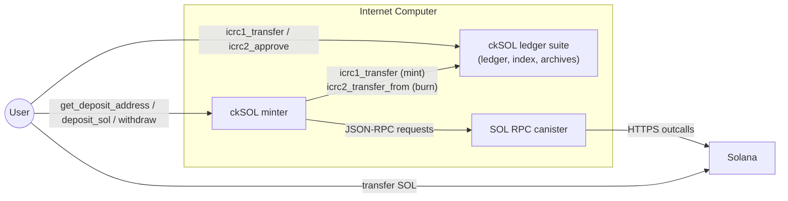
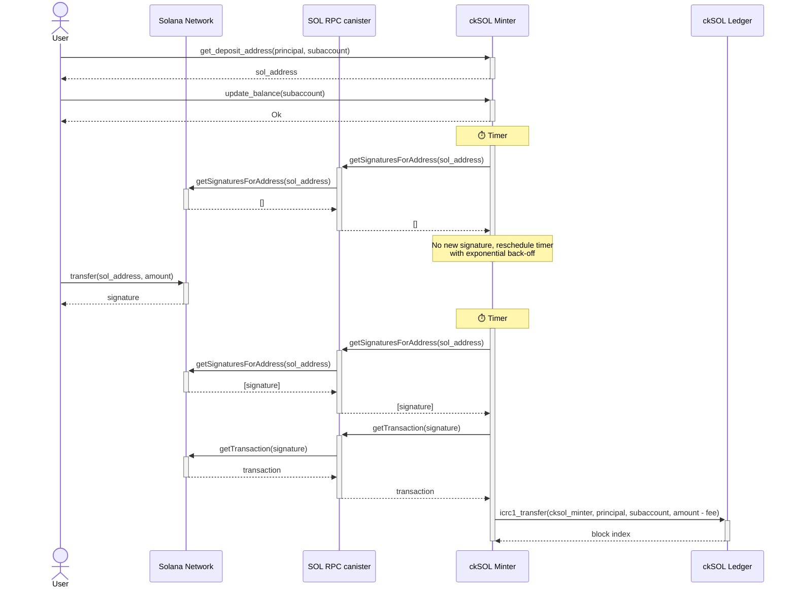
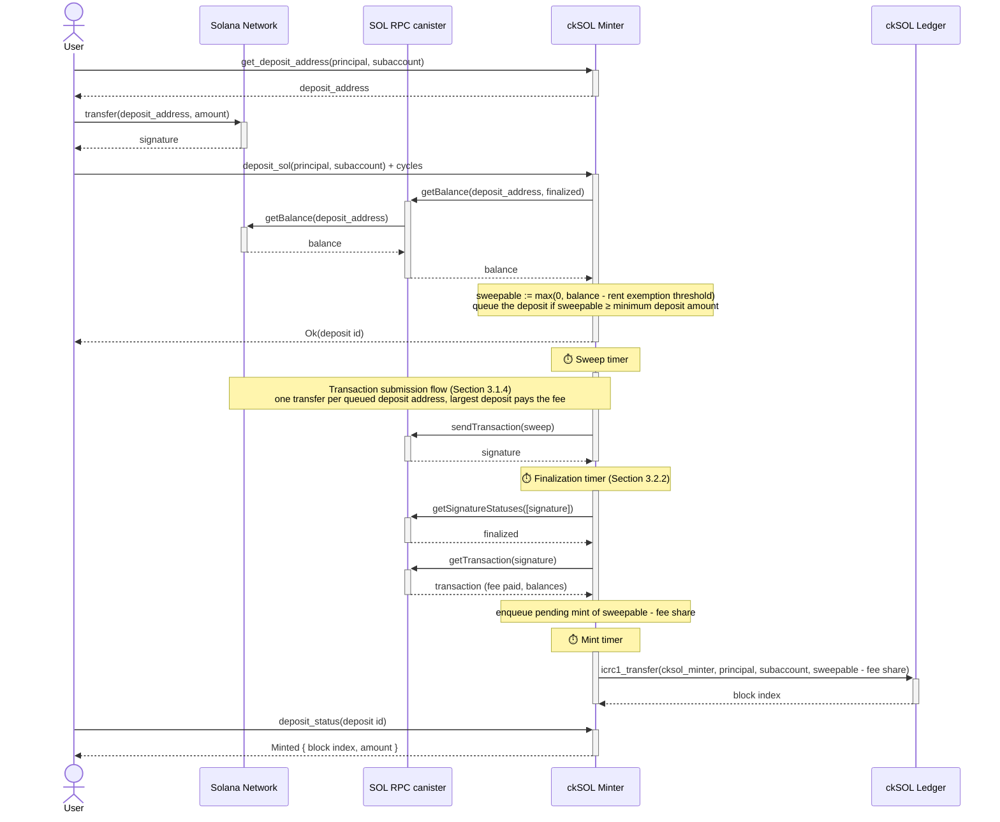
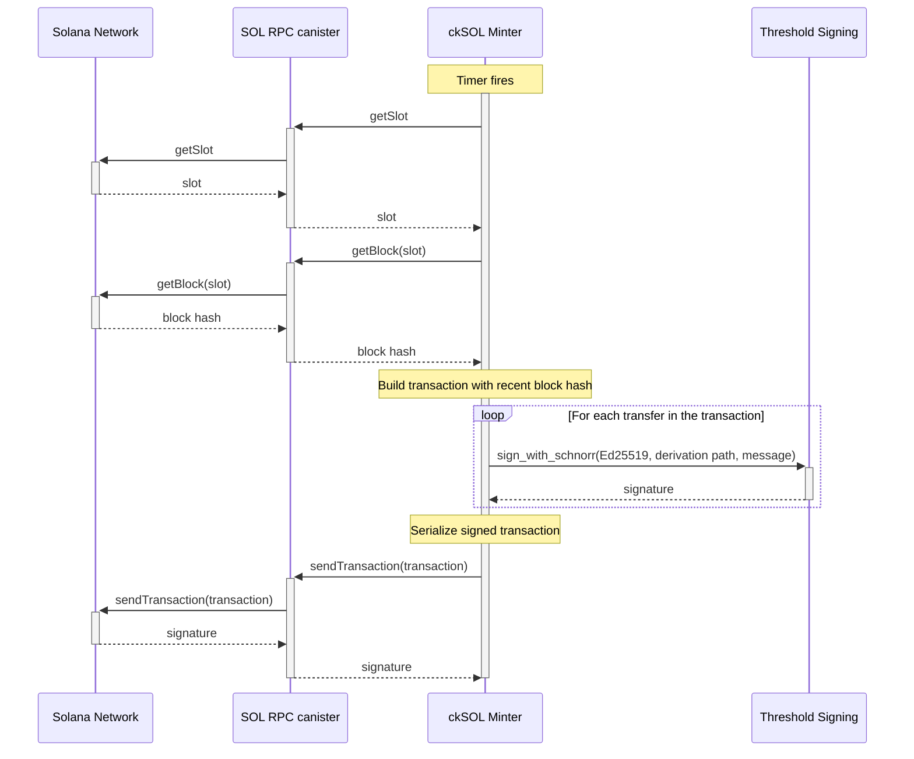
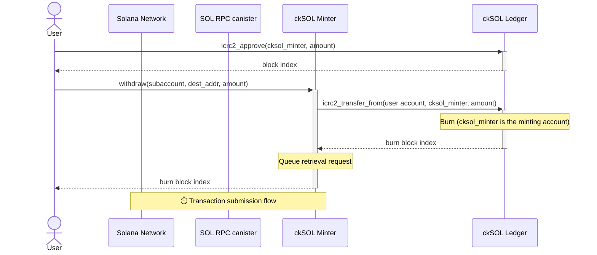
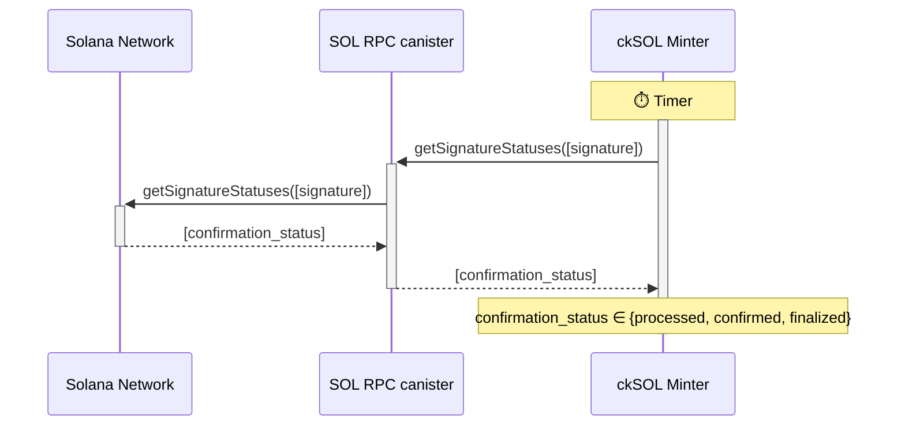
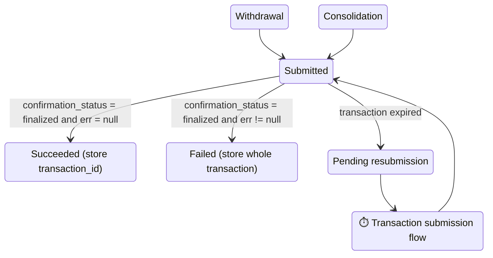

# Chain-Key SOL (ckSOL) Design

This document is a port of the original ckSOL scoping and design document. Diagrams were redrawn as Mermaid diagrams from the original figures.

## 1. High-Level Goal

The goal is to support a new ICRC-2 (and ICRC-3) compliant token on the IC, called chain-key Solana (**ckSOL**), that is backed 1:1 by SOL, the primary token on the Solana blockchain. Users should be able to convert their SOL tokens to ckSOL and vice versa.

## 2. Overview

The ckSOL functionality is introduced with a new canister (**ckSOL minter**) together with an instance of the ICRC ledger suite, in particular a ledger canister (**ckSOL ledger**), index canister, and archive canisters. The ckSOL minter *default account* is the *minting account* of the ckSOL ledger.

The ckSOL minter is the canister responsible for managing deposited SOL and minting/burning ckSOL. Concretely, it provides the following functionality:

- **Mint**: If a user transfers SOL to a specific account under the ckSOL minter's control, the ckSOL minter can instruct the ckSOL ledger to mint ckSOL for the user, owned by a given ICRC account (principal ID-subaccount pair).
- **Burn**: After granting the ckSOL minter access to some of the user's funds, the user can request a withdrawal of SOL to be sent to a user-provided destination address. The funds are sent out after instructing the ckSOL ledger to burn the requested amount of ckSOL tokens.

Both operations, as well as the transfer of ckSOL, incur a fee as specified in [Section 3.3](#33-fees--minimum-swap-amounts).

The general model is that the ckSOL minter needs to receive SOL *before* it mints ckSOL, and it burns ckSOL *before* it transfers SOL back to the users, in order to ensure that the total supply of ckSOL is always upper bounded by the amount of SOL held by the ckSOL minter.

In addition to performing the mint and burn transactions, the ckSOL ledger is responsible for keeping account balances and for transferring ckSOL between accounts. As mentioned before, the ckSOL ledger must be ICRC-1, ICRC-2, and ICRC-3 compliant. As the ckSOL ledger is a standard ICRC ledger, the following sections are concerned with the design of the ckSOL minter.

The following figure summarizes how the user, the ckSOL minter, the ckSOL ledger, and the SOL RPC canister interact. Each interaction is described in detail in [Section 3](#3-technical-details).



## 3. Technical Details

The ckSOL minter interacts with the Solana blockchain via the [SOL RPC canister](https://github.com/dfinity/sol-rpc-canister). The ckSOL minter uses the following subset of endpoints:

- [getBlock](https://solana.com/docs/rpc/http/getblock): Returns the block for the given slot. This function is used to get a recent block hash, which is contained in the response. Note that `transactionDetails` is set to `null` in the request. As a result, signatures and transactions are not returned.
- [getSignaturesForAddress](https://solana.com/docs/rpc/http/getsignaturesforaddress): Returns the signatures for a given address. This function is used to learn about new transactions (in Solana, signatures are used to identify transactions, as the first signature in a transaction is considered the transaction ID).
- [getSignatureStatuses](https://solana.com/docs/rpc/http/getsignaturestatuses): Returns the status of each transaction specified through its identifier, i.e., the first signature in the transaction. This function is used to determine whether or not a transaction has been finalized or needs to be resubmitted.
- [getSlot](https://solana.com/docs/rpc/http/getslot): Returns the current slot. Since the slot number changes rapidly, the SOL RPC canister merely obtains a rounded and therefore slightly outdated slot number. The slot number is required to obtain a recent block hash using `getBlock`. Moreover, `getSlot` is used to check if an unconfirmed transaction has expired.
- [getTransaction](https://solana.com/docs/rpc/http/gettransaction): Returns the whole transaction for the given signature.
- [sendTransaction](https://solana.com/docs/rpc/http/sendtransaction): Sends out the provided transaction. It requires the execution of the functions `getSlot` and `getBlock` to obtain a recent block hash, which must be part of the transaction.

### 3.1. Converting SOL to ckSOL

The process of converting SOL to ckSOL should be as simple as possible for the user, or more generally for any frontend that offers this functionality. It should further be possible to convert SOL held on centralized exchanges straight to ckSOL. While SOL transfers can bear a memo, which would make it possible to use the same destination address, controlled by the ckSOL minter, for all conversions, most popular centralized exchanges do not offer the option to specify a memo, making a direct transfer to a single address infeasible, as the ckSOL minter could not determine the ICRC account (principal ID plus subaccount) that should be credited for received funds.

The chosen approach is to derive a **deposit address** for a given ICRC account: The user calls the endpoint `get_deposit_address` with a principal ID and subaccount as parameters on the ckSOL minter and receives a derived SOL address in return. Note that the SOL address is derived deterministically, i.e., always the same address is returned for the same principal ID and subaccount. Since it is a deterministic function, other pieces of software, such as frontends or other canisters, can derive deposit addresses themselves instead of querying the ckSOL minter.

Concretely, the deposit address is the ckSOL minter's address with the user's account (principal ID and subaccount) used [as the derivation path](https://github.com/dfinity/ic/blob/215615d2d08f2679126fbe074bbff2e1bf3064dc/rs/bitcoin/ckbtc/minter/src/address.rs#L102), i.e., effectively the same mechanism as for [ckBTC](https://learn.internetcomputer.org/hc/en-us/articles/44598021228564-Chain-key-Bitcoin) is used to generate a user-specific address. The user can then transfer the desired amount to this address. Two separate deposit flows are supported, which are introduced next.

#### 3.1.1. Validating a Solana Deposit Transaction

Here is an example of a [SOL deposit transaction](https://solscan.io/tx/4ufenqv8AWdSDeU3q9N8239n19oQRvBrP1J9uGv9VnHaddcEswQpmXLjCbcCmQLYi1vcD4E2zD7aUsA5366XHdYn) from a wallet to a deposit address, showing the information that is returned.

```shell
curl --location 'https://api.mainnet.solana.com' \
--header 'Content-Type: application/json' \
--data '{
    "jsonrpc": "2.0",
    "id": 1,
    "method": "getTransaction",
    "params": [
       "4ufenqv8AWdSDeU3q9N8239n19oQRvBrP1J9uGv9VnHaddcEswQpmXLjCbcCmQLYi1vcD4E2zD7aUsA5366XHdYn",
        {
            "encoding":"jsonParsed",
            "maxSupportedTransactionVersion":0
        }
    ]
}'
```

```json
{
  "jsonrpc": "2.0",
  "result": {
    "blockTime": 1770381594,
    "meta": {
      "computeUnitsConsumed": 450,
      "costUnits": 1784,
      "err": null,
      "fee": 80000,
      "innerInstructions": [],
      "logMessages": [
        "Program ComputeBudget111111111111111111111111111111 invoke [1]",
        "Program ComputeBudget111111111111111111111111111111 success",
        "Program ComputeBudget111111111111111111111111111111 invoke [1]",
        "Program ComputeBudget111111111111111111111111111111 success",
        "Program 11111111111111111111111111111111 invoke [1]",
        "Program 11111111111111111111111111111111 success"
      ],
      "postBalances": [
        17595721,
        10000000,
        1,
        1
      ],
      "postTokenBalances": [],
      "preBalances": [
        27675721,
        0,
        1,
        1
      ],
      "preTokenBalances": [],
      "rewards": [],
      "status": {
        "Ok": null
      }
    },
    "slot": 398443979,
    "transaction": {
      "message": {
        "accountKeys": [
          {
            "pubkey": "6TqNg48mSd5evmY66JVfGeGTwszrU1YLCeSw3GJ2qsUC",
            "signer": true,
            "source": "transaction",
            "writable": true
          },
          {
            "pubkey": "387njEppTfLSwaGN2hgSNUTMpbCZgu2xaiEY9Nj1QPbG",
            "signer": false,
            "source": "transaction",
            "writable": true
          },
          {
            "pubkey": "11111111111111111111111111111111",
            "signer": false,
            "source": "transaction",
            "writable": false
          },
          {
            "pubkey": "ComputeBudget111111111111111111111111111111",
            "signer": false,
            "source": "transaction",
            "writable": false
          }
        ],
        "instructions": [
          {
            "accounts": [],
            "data": "3b1H8Rq1T3d1",
            "programId": "ComputeBudget111111111111111111111111111111",
            "stackHeight": 1
          },
          {
            "accounts": [],
            "data": "LKoyXd",
            "programId": "ComputeBudget111111111111111111111111111111",
            "stackHeight": 1
          },
          {
            "parsed": {
              "info": {
                "destination": "387njEppTfLSwaGN2hgSNUTMpbCZgu2xaiEY9Nj1QPbG",
                "lamports": 10000000,
                "source": "6TqNg48mSd5evmY66JVfGeGTwszrU1YLCeSw3GJ2qsUC"
              },
              "type": "transfer"
            },
            "program": "system",
            "programId": "11111111111111111111111111111111",
            "stackHeight": 1
          }
        ],
        "recentBlockhash": "8QFcHAXJZZXSTbHqbZHUtZerSG4SEWauP6q4Xa5nGitW"
      },
      "signatures": [
        "4ufenqv8AWdSDeU3q9N8239n19oQRvBrP1J9uGv9VnHaddcEswQpmXLjCbcCmQLYi1vcD4E2zD7aUsA5366XHdYn"
      ]
    },
    "version": "legacy"
  },
  "id": 1
}
```

The ckSOL minter processes such a transaction as follows. The involved addresses are extracted, which are the `pubkey` fields under `transaction.message.accountKeys`. Additionally, the `preBalances` and `postBalances` are read to see how much was transferred to the individual addresses affected by this transaction. This data must be identical across the various responses from the RPC providers, but the validation covers the whole transaction for the sake of simplicity.

This list is then used to derive the transferred amounts to and from each of the involved addresses, corresponding to the differences between the post- and pre-balances. The ckSOL minter will then search for the addresses of interest in this list, read the transferred amount, and take action accordingly.

#### 3.1.2. Automated Flow (Outdated)

> [!WARNING]
> The automated flow is currently not implemented. It is deferred to a post-launch upgrade and must be revisited on top of the manual flow of [Section 3.1.3](#313-manual-flow), so that a deposit address is only ever credited by one mechanism.

When a user calls the endpoint `update_balance`, the ckSOL minter will check transfers to the deposit address derived for the caller's principal ID and the provided subaccount (if any) on a timer by calling the `getSignaturesForAddress` endpoint on the SOL RPC canister, filtering out failed transactions (based on the `err` field in the response). If previously unknown (finalized) signatures are returned, the ckSOL minter will call the `getTransaction` endpoint for the newly obtained signatures. The transaction data contains information about the transferred amount, which will then be minted, minus a certain fee (defined in [Section 3.3.2](#332-cksol-minter-fees)), on the ckSOL ledger using an `icrc1_transfer` call, crediting the user's account.

The user must transfer at least the **minimum deposit amount**, defined in [Section 3.3.3](#333-minimum-swap-amounts). Any deposit below this amount is ignored.

The returned transaction can contain SOL transfers as *top-level instructions*, i.e., the transaction (message) instructions contain instructions of type "transfer" for program "system". Alternatively, SOL transfers can be made via *inner instructions*, i.e., the transfer happens through a cross-program invocation (CPI). Such transfers can be extracted from the "meta" data of the transaction. The implementation must capture transfers of both types.

**Note**: Some transfers are not captured, e.g., transfers via the [CloseAccount](https://solana.com/docs/tokens/basics/close-account) instruction. The fact that there are corner cases where no mint occurs is accepted for now and will be addressed at a later stage.

The flow is depicted in the following figure (fee refers to the deposit fee).



The user's account is cached, together with the derived Solana address, so that the function called on a timer to check for newly arrived funds can access the required information. The timer mechanism works as follows. After an initial waiting time, the timer executes for the first time.

The following scheme is proposed to bound the number of timer invocations per deposit address. At most `MAX_GET_SIGNATURES_CALLS = 10` calls are made, with the interval between calls doubling from **1, 2, 4, 8, 16, 32, 64, 128, 256, up to 512 minutes**, for a total of **1023 minutes**, i.e., slightly more than 17 hours. The timer is not set anymore whenever a call returns at least one new signature that results in a mint operation.

In order to mitigate the risk of a denial-of-service attack, each account has a certain **quota** for the automatic flow, which consists of a quota for `getSignaturesForAddress` calls and a quota for `getTransaction` calls. Initially, the quotas are `MAX_GET_SIGNATURES_CALLS` and `MAX_RETRIEVED_TRANSACTIONS`, respectively. Calls of either type are only made if there is a positive remaining quota.

Since each IC account gets a newly derived deposit address, these addresses are likely involved in deposits only, i.e., there should not be many `getTransaction` calls in vain in the common case. Whenever there is a successful call that results in a mint, both quotas are increased by 2 for the following reason: They are both bumped by 1 so that calls that result in a mint do not count against the quotas. The additional bump of each quota serves to ensure that an occasional call that does not result in a mint operation does not slowly drain the free quota. Note that RPC calls may sporadically fail for various reasons, such as network issues or RPC providers being unavailable. There is a ceiling of `MAX_GET_SIGNATURES_CALLS` and `MAX_RETRIEVED_TRANSACTIONS` for the `getSignaturesForAddress` quota and the `getTransaction` quota, respectively.

The mechanism to replenish a depleted quota is discussed in the next section.

The quota is meant as a deterrent but does not stop an attacker from triggering many `getTransaction` calls for different addresses. In order to limit the impact of such an attack, the constant `MAX_MONITORED_ADDRESSES` specifies the global limit on the number of addresses for which automatic deposits are allowed at any given time. This constant also limits the memory consumption. Furthermore, `update_balance` only takes a subaccount parameter, i.e., it is not possible to call the function for other principals, preventing drainage attacks against the quotas of other users.

If a returned transaction contains one or more transfers to the user's deposit address, the sum of the transferred amounts, minus a fee, is minted in a *single* `icrc1_transfer` call to the ckSOL ledger. As mentioned before, no ckSOL is minted if the amount is below the minimum deposit amount.

The ckSOL minter must keep track of the covered range for each address for the sake of performance. Unfortunately, the `getSignaturesForAddress` endpoint does not allow a forward search starting from some transaction signature. Therefore, for each address that has ever been tracked, the covered range must be maintained. If an `update_balance` call is made and both quotas are positive, the following steps are executed.

```text
// Initially max_parsed = ⊥, gap_upper = gap_lower = genesis_sig
// limit = MAX_RETRIEVED_TRANSACTIONS
if gap_upper = gap_lower:
    [s_1,...,s_n] := getSignaturesForAddress(limit, until=gap_upper)
    if n < limit:    // All signatures have been returned in the range
        max := s_1, gap_upper := max, gap_lower := max
    else:    // There might be a gap between s_n and gap_lower
        max := s_1, gap_upper := s_n
else:    // The gap between gap_upper and gap_lower must be closed
    [s_1,...,s_n] := getSignaturesForAddress(limit, before=gap_upper, until=gap_lower)
    if n < limit:    // All signatures have been returned in the range
        gap_upper := max, gap_lower := max
    else:    // The gap has been reduced but may not be closed yet
        gap_upper := s_n
process(s_1,...,s_n)
```

The idea is to cover the whole range since genesis. Assuming that the latest transaction signature that has ever been returned in previous calls is `max`, if reading from the current block returns `MAX_RETRIEVED_TRANSACTIONS` transactions, it is unclear whether there are more transaction signatures between the oldest returned transaction and `max`. In subsequent calls, the algorithm above closes this gap before requesting transaction signatures that are more recent than `max`.

**Note**: It is possible that an address appears in many transactions that do not change the balance of the account. If there are more than `MAX_RETRIEVED_TRANSACTIONS` such transactions, the quota can be exhausted before a valid deposit is discovered. Deposits can always be processed using the manual flow, but the automatic flow may not work until all past transactions for this address have been processed. This risk is currently accepted.

**Note**: There may be only one active timer per deposit address at any time across all endpoints that interact with the deposit address.

Since tracking stops when a deposit is discovered, the question is how transaction signatures are treated that have been obtained via `getSignaturesForAddress` calls but have not been requested and processed. A related question is how `getTransaction` calls are scheduled if there are multiple tracked addresses with outstanding `getTransaction` calls. The ckSOL minter treats the problem of deciding which transactions to query and which transactions to request next separately. The mechanism outlined above decides which transactions are to be queried next. These are put into a map with the account as the key and the value being a queue of transaction signatures, corresponding to the transactions to be obtained and checked next. Whereas the mechanism above adds transaction signatures to the map, the ckSOL minter iterates over the monitored accounts in insertion order and collects signatures to check in a round-robin fashion. Once tracking of an account stops, the corresponding entry in the map is removed.

HTTPS outcalls are a scarce resource. Therefore, the number of in-flight requests should be bounded. Concretely, there should never be more than `MAX_IN_FLIGHT_HTTPS_OUTCALLS` outcalls being processed at the same time. Requests on a timer are only scheduled if there is capacity for outcalls.

Proposed values for the parameters are provided in this list:

- `MAX_RETRIEVED_TRANSACTIONS`: This constant is the product of the number of transaction requests that can be packed into a JSON batch request and the maximum number of `getTransaction` calls that the ckSOL minter may make for a single `get_deposit_address` call. Batching is not yet available, so currently the only parameter is the number of transaction requests, which can initially be set to **50**.
- `MAX_MONITORED_ADDRESSES`: The number of monitored addresses must be upper bounded as well. Since HTTPS outcalls are protected by imposing an upper bound on the number of in-flight outcalls and an address does not take up too much space, a fairly large number of addresses could be monitored. The reason to keep this number on the small side is that a cycle drainage attack could be launched by having the ckSOL minter spend many cycles monitoring a large number of addresses. A compromise would be to set the parameter to a conservatively low value of **100** initially.
- `MAX_IN_FLIGHT_HTTPS_OUTCALLS`: The maximum number of in-flight HTTPS outcalls. The suggested parameter is **56**, as used in the [exchange rate canister](https://github.com/dfinity/exchange-rate-canister/blob/62f286325b6ce49233572a77479c8ca649f21e0a/src/xrc/src/rate_limiting.rs#L7).

#### 3.1.3. Manual Flow

A user who has transferred SOL to their deposit address asks the ckSOL minter to *sweep* that address. The user does not identify individual Solana transactions: the ckSOL minter reads the balance of the deposit address, moves it to its main account, and mints ckSOL once that sweep is finalized. As a consequence, several transfers that are each below the minimum deposit amount are credited together once their sum exceeds it, and deposits from centralized exchanges, which typically do not show the transaction signature to the user, need nothing but the deposit address.

The manual flow is depicted in the following figure. The sweep reuses the transaction submission flow and the finalization flow described in [Section 3.1.4](#314-consolidation) and [Section 3.2.2](#322-finalization-and-resubmissions).



**Request.** The flow is triggered by calling `deposit_sol` with the user's account (principal ID and subaccount) as parameters. The principal may differ from the caller's, so that a frontend or another canister can pay for a user's deposit, but it must not be the anonymous principal. The endpoint requires cycles to be attached; the required amount is exposed as `process_deposit_required_cycles` in `get_minter_info` and, as explained below, most of it is refunded. At most one deposit per account can be in flight: if a deposit for the given account is queued, swept, or finalized but not yet minted, the call fails with an error carrying the id of the in-flight deposit and refunds all attached cycles without contacting the SOL RPC canister. Only a deposit that is minted or dropped allows a new sweep of the same account. If the latest deposit of the account is quarantined, the call is rejected with an error carrying the id of the quarantined deposit, since the SOL of that deposit has reached the main account without being credited, and the account remains rejected until manual intervention resolves the quarantined deposit. The account is reserved before the first inter-canister call, so that concurrent calls for the same account cannot both pass this check, and the reservation is released on every error path.

**Balance check.** The ckSOL minter calls the `getBalance` endpoint of the SOL RPC canister for the deposit address at the `finalized` commitment level. The `minContextSlot` parameter is set to the slot at which the previous sweep of this address was finalized, so that a lagging RPC provider cannot report a balance that still includes funds already swept. The *sweepable amount* is the balance minus the **rent exemption threshold** (890,880 lamports for an account without data), or zero if the balance does not exceed the threshold. This threshold is deliberately left on the deposit address: Solana rejects any transaction that would leave an account with a nonzero balance below the threshold, so sweeping the whole balance would fail as soon as a small transfer arrived between the balance check and the execution of the sweep. Keeping the threshold on the address makes the sweep independent of concurrent transfers. The threshold is paid once per deposit address, since later sweeps find it already in place.

If the sweepable amount is below the **minimum deposit amount** defined in [Section 3.3.3](#333-minimum-swap-amounts), the call fails with `ValueTooSmall`, reporting the sweepable amount and the minimum, so that the user knows how much to top up. Only the cost of the `getBalance` call is charged in this case. Otherwise the deposit is recorded as *queued* with the account, the deposit address, and the sweepable amount, and the call returns a *deposit id*, a sequence number assigned by the ckSOL minter that identifies this sweep of the account for the rest of its life, in the same way as a withdrawal is identified by its burn index. The cycles charged are the cost of the `getBalance` call plus the **deposit consolidation fee**, which covers the threshold signature of the sweep and the deposit's share of the RPC calls made by the sweep and finalization timers, as detailed in [Section 3.3.2](#332-cksol-minter-fees). The remaining cycles are refunded.

**Sweep.** A timer, running at the same frequency as withdrawal processing, takes up to 10 queued deposits and submits one Solana transaction for them following the transaction submission flow of [Section 3.1.4](#314-consolidation). Each deposit address signs a transfer of its sweepable amount to the main account of the ckSOL minter. The deposit address with the largest sweepable amount is the fee payer; it is listed first in the transaction and its transfer is reduced by the transaction fee of `5000 * k` lamports for `k` signatures. Since the minimum deposit amount is larger than the fee of a full batch (see [Section 3.3.4](#334-parameter-constraints)), the fee payer always has enough funds, and every deposit address is left with the rent exemption threshold plus whatever arrived after the balance check. The deposits are recorded as *swept* together with the transaction signature. No ckSOL is minted yet.

**Finalization.** The sweep transaction is monitored like any other transaction, as described in [Section 3.2.2](#322-finalization-and-resubmissions). Once the transaction is finalized successfully, the deposits it contains are recorded as *finalized*: the SOL has moved to the main account, and the remaining steps only account for it. From this point on, `deposit_status` reports `Finalized` with the sweep signature until the mint lands. The ckSOL minter then fetches the transaction with `getTransaction` and reads the fee that was actually charged from the transaction metadata, rather than assuming it, so that a change in the fee schedule of Solana can never cause the ckSOL minter to mint more than it received. The pre- and post-balances in the metadata are used as a sanity check: every deposit address must have decreased by exactly its transfer amount, plus the fee for the fee payer, and must end with at least the rent exemption threshold, since a transfer that arrived after the balance check legitimately leaves more. If the `getTransaction` call fails, the deposits stay finalized and the fetch is retried on the next run of the finalization timer. If the fetch succeeds but the sanity check fails, the ckSOL minter's model of the transaction is wrong, so nothing is minted: the deposits are *quarantined*, reusing the existing mechanism that prevents double minting, are reported on the dashboard together with the sweep signature, and the number of quarantined deposits is exposed as a metric. They are not processed further without manual intervention. The balance of the main account is increased by the sum of the sweepable amounts minus the fee. Then, for each deposit in the transaction, the ckSOL minter enqueues a *pending mint* of the sweepable amount minus the deposit's share of the fee, `ceil(fee / k)`, to the user's account. The total of the pending mints is therefore never larger than the amount received on the main account. Pending mints are processed on a timer: each one is a single `icrc1_transfer` call whose memo contains the sweep signature. The `created_at_time` of the transfer is fixed when the pending mint is enqueued and stored with it, so that every retry sends exactly the same arguments and the ckSOL ledger deduplicates it: a mint whose ledger call fails stays in the queue and is retried on the next run, and a `Duplicate` reply from the ledger is recorded as a successful mint with the block index it carries. Since the ledger only deduplicates transfers within its 24-hour window, a pending mint older than that is quarantined instead of retried. The sweep transaction itself is never resubmitted once it is finalized. A user can follow the progress with `deposit_status`, which takes a deposit id and reports its status: `Queued` with the sweepable amount, `Swept` and `Finalized` with the sweep signature, `Minted` with the ledger block index, and `Dropped` and `Quarantined` with the sweep signature when there is one. Since every sweep has its own id, a `Minted` status stays observable after the account has been swept again; the mint itself is also visible on the ckSOL ledger, whose memo links it to the sweep signature.

Two failure cases exist before the transaction is finalized, and neither is retried by the ckSOL minter:

1. The transaction is finalized with an error. The funds are still on the deposit addresses, minus the fee paid by the fee payer. This should never happen with the invariants above, so it is reported as an error in the logs and in the metrics.
2. The transaction expires, i.e., its blockhash is no longer valid and it has no on-chain status. Contrary to withdrawals, the sweep is *not* resubmitted. Expiry is determined against the last valid block height persisted with the transaction, as described in [Section 3.2.2](#322-finalization-and-resubmissions), never by counting slots; otherwise a transaction declared expired could still land, and the funds would reach the main account without being credited.

In both cases the queued deposits are marked as *dropped*, and the number of dropped deposits is exposed as a metric. Since nothing was minted, no user is owed anything, and the user simply calls `deposit_sol` again to queue a new sweep of the balance that is still on the deposit address. In other words, the retry is triggered and paid for by the caller.

**Example.** The following example uses the parameters of [Section 3.3](#33-fees--minimum-swap-amounts), a price of 1 SOL = 100 USD, and 1T cycles = 1 XDR = 1.44 USD. Alice deposits 1 SOL and Bob deposits 0.05 SOL, each to their own deposit address, which was empty before, and both deposits are swept in the same transaction.

| Stage | Alice | Bob | Paid by | Notes |
| --- | --- | --- | --- | --- |
| 1. Transfer to the deposit address | 1,000,000,000 lamports (1 SOL) | 50,000,000 lamports (0.05 SOL) | User's wallet | The Solana fee of 5,000 lamports for this transfer is paid by the sender on top of the amount and is not visible to the ckSOL minter. |
| 2. `deposit_sol` with 1T cycles attached | charged 47.1B cycles (0.068 USD) | charged 47.1B cycles (0.068 USD) | Caller, in cycles | 2.1B cycles for `getBalance` plus the deposit consolidation fee of 45B cycles. 952.9B cycles are refunded. |
| 3. Sweepable amount | 999,109,120 lamports | 49,109,120 lamports | | Balance minus the rent exemption threshold of 890,880 lamports (0.089 USD), which stays on the deposit address. |
| 4. Sweep transaction fee | 10,000 lamports paid on-chain | 0 | Fee payer (Alice) | Two signatures at 5,000 lamports each. Alice transfers 999,099,120 lamports, Bob transfers 49,109,120 lamports. Both deposit addresses end at 890,880 lamports; the main account receives 1,048,208,240 lamports. |
| 5. Mint | 999,104,120 lamports (0.99910412 ckSOL) | 49,104,120 lamports (0.04910412 ckSOL) | | Sweepable amount minus the fee share of `ceil(10,000 / 2) = 5,000` lamports. The total of 1,048,208,240 equals the amount received on the main account. |

For Alice, converting 1 SOL to ckSOL costs 895,880 lamports (0.0896 USD) on Solana, of which 890,880 lamports remain on her deposit address and are not charged again for her next deposit, plus 47.1B cycles (0.068 USD). Bob pays the same, so smaller deposits pay a proportionally larger share; a deposit whose sweepable amount is exactly the minimum deposit amount of 0.02 SOL would be credited 19,995,000 lamports, i.e., 99.975% of the amount swept.

If Bob then withdraws everything, he first approves the ckSOL minter, which costs the ledger transfer fee of 500 lamports, and then withdraws the remaining 49,103,620 lamports. After the withdrawal fee of 1,000,000 lamports, the destination address receives 48,103,620 lamports (0.04810362 SOL). The whole round trip from 0.05 SOL to 0.04810362 SOL costs 1,896,380 lamports (0.19 USD), of which 890,880 lamports are still under the control of the ckSOL minter on Bob's deposit address, plus the cycles attached to `deposit_sol`.

#### 3.1.4. Consolidation

Since users deposit funds in dedicated deposit addresses, the ckSOL minter's funds are spread across multiple addresses, making withdrawals inconvenient. Therefore, a consolidation mechanism is introduced that transfers the funds from deposit addresses to the main address of the ckSOL minter. In the manual flow of [Section 3.1.3](#313-manual-flow), the consolidation is the sweep itself: ckSOL is minted only once the consolidation transaction is finalized. The general flow for submitting a transaction is shown in the following figure.



All transactions are created on a timer. Since a transaction must contain a recent block hash, such a block hash must be obtained first: A `getSlot` call is used to get a recent slot, followed by a `getBlock` call to retrieve block details, in particular the block hash, for the slot received in the first step. Note that it is possible that there is no block for a certain slot, in which case `getSlot` needs to be called again, followed by another call to `getBlock`. The figure only shows the happy path of one call each. Given a recent block hash, the transaction is built, obtaining an EdDSA signature for each transfer to be made within that transaction. The block height of the block whose hash is used is persisted together with the transaction: a block hash is valid for 150 blocks after that height, and this *last valid block height* is what expiry is later checked against. Once the transaction is signed and serialized, it is sent to the SOL RPC canister, which forwards it to the RPC providers.

A timer is run periodically, triggering the consolidation. It is likely sufficient to invoke the consolidation at a low frequency, such as once every 10 minutes. A single SOL transfer requires roughly 70-90 bytes in a transaction. Since the maximum transaction size is 1232 bytes, up to approximately **10 consolidation transfers** per transaction are possible. Whenever the timer executes and there is *any* unconsolidated address, then consolidation transactions are created and issued, with up to 10 transfers per transaction, until *all* deposits have been consolidated. Multiple transactions can be batched in a single HTTPS outcall.

A concrete mainnet example of a transaction that makes two transfers to the same destination address can be viewed [here](https://solscan.io/tx/5CzNKyQsSfAtCQAxnj6acuhQZEh5J4B8aZzV1ArvvM8vodUr4vcQu7Co8wzbHrSYMW4h8ikg67bqCZSU4AHiL1D9).

Note that the default compute unit (CU) limits are [200,000 CUs per instruction and 1,400,000 per transaction](https://solana.com/hi/docs/core/fees/compute-budget). A standard transfer consumes around [300 CUs](https://research.topledger.xyz/blogs/compute-units-and-transaction-bytes-on-solana), well below the instruction limit. Moreover, 10 transfers together is still clearly below the transaction limit. In short, there is no need to bump the *compute allocation* for such transactions. The transaction fee only depends on the number of signatures. If there are k ≤ 10 signatures, one signature for each consolidation transfer, where the first signer is the fee payer, the fee is `5000 * k` lamports. The deposit address with the largest amount to consolidate is listed first and pays the transaction fee; its transfer is reduced by the fee, so that every deposit address is left with exactly the rent exemption threshold.

### 3.2. Converting ckSOL to SOL

#### 3.2.1. Submitting Withdrawal Requests

Converting ckSOL back to SOL requires two user actions: The user must approve the ckSOL minter to withdraw from their ckSOL account by calling `icrc2_approve` and then call `withdraw`. Naturally, the user may approve the ckSOL minter to withdraw a large amount from their account so that multiple `withdraw` calls can be performed without the need to create new approvals.

The `withdraw` endpoint has the following parameters: An optional subaccount, the destination address on Solana, and the amount to be withdrawn. When receiving such a request, the ckSOL minter issues an `icrc2_transfer_from` call, sending the requested amount from the account corresponding to the caller's principal ID plus the provided subaccount (if any) to its own account. Since its account is the minting account, this transfer is a burn operation, burning the given amount.

If this burn operation is successful, the retrieval request is added to an internal queue and the block index of the burn operation is returned to the user. Otherwise, an error is returned.

When the timer strikes, up to 10 retrieval requests are batched into a single transaction and sent to the SOL RPC canister. The flow is shown in the following figure, using the transaction submission flow defined above.



Since Solana has a high block rate, the timer should execute more frequently compared to ckBTC. The proposed interval is **10 seconds**. A shorter interval between calls implies that there is a lower chance of retrieval requests being batched together; however, it is preferable to have smaller batches, as transactions are cheap and it provides a better user experience.

There is a **minimum withdrawal amount**, which is defined in [Section 3.3.3](#333-minimum-swap-amounts).

The funds for each withdrawal are taken from the main account. Since ckSOL is only minted once the corresponding SOL has reached the main account (see [Section 3.1.3](#313-manual-flow)), the main account always covers the minted supply, and a withdrawal never waits for or triggers a consolidation. The only delay a user can experience is between a `deposit_sol` call and the mint of their own deposit.

#### 3.2.2. Finalization and Resubmissions

The statuses of (consolidation or withdrawal) transactions are checked on a timer by calling the `getSignatureStatuses` endpoint on the SOL RPC canister. The status of any accepted transaction is either `processed`, `confirmed`, or `finalized`.



It is possible that a transaction is not accepted, i.e., it is not found in any of the statuses listed above. Since ckSOL tokens are not reimbursed, the transaction must be resubmitted until it is confirmed; however, care has to be taken to ensure that there is no double spending. Solana transactions refer to a recent block hash. The block hash may not be more than 150 blocks in the past, which corresponds to roughly 90 seconds.

A transaction is expired once the current block height, obtained with a `getBlockHeight` call at the `finalized` commitment level, exceeds the last valid block height persisted with the transaction. Expiry is never determined by counting slots, since slots can be skipped and a transaction declared expired too early could still land. If there are expired transactions that are not found, i.e., they did not even reach the status `processed`, they need to be resubmitted. The different states and their transitions internal to the ckSOL minter are shown in the following figure.



The withdrawal and consolidation flows result in the submission of a transaction, which is then in the `Submitted` state. The status of submitted transactions is checked on a timer as outlined above. If a transaction reaches the confirmation status `finalized`, there are two cases: If the transaction was finalized successfully, i.e., without errors, the transaction transitions to the state `Succeeded` and its ID is stored permanently. If there was an error, the transaction transitions to the state `Failed` and is stored in its entirety so that it can be analyzed what happened. Ideally, no transaction ever ends up in this state. However, it is possible for transactions to fail, for example by attempting to withdraw SOL to a program account, which is not allowed. As there is no reimbursement flow, the user's funds would be stuck in this case. Storing the whole failed transaction ensures that the funds are not lost and appropriate actions may be taken when such transactions are encountered.

If the transaction expires, i.e., it is unknown after 150 blocks, it enters the `Pending resubmission` state. A different timer fetches transactions from this state, following the transaction submission flow to submit it again, at which point the transaction is back in the `Submitted` state. Sweep transactions of the manual flow are the exception: an expired sweep is never resubmitted but dropped, as described in [Section 3.1.3](#313-manual-flow), since nothing has been minted for it yet and the user can simply queue a new sweep.

A prioritization fee is not required under normal load, therefore it is omitted. If the need arises to bump fees, this topic will be revisited.

### 3.3. Fees & Minimum Swap Amounts

#### 3.3.1. ckSOL Ledger Fees

**Summary**:

- ckSOL transfer fee: 0.0000005 SOL (500 lamports)

A SOL or SPL token transfer costs 0.000005 SOL = 5000 lamports, which corresponds to 0.0005 USD at 1 SOL = 100 USD.

Executing a token transfer on an ICRC ledger consumes roughly 1.2M cycles on a 13-node subnet, which corresponds to 3.14M cycles on a 34-node subnet such as the fiduciary subnet.

This cycles cost corresponds to 3.14 × 10⁻⁶ XDR = 4.5216 × 10⁻⁶ USD = 4.5216 × 10⁻⁸ SOL = 45.2 lamports. As there are additional costs, such as maintaining the index canister, the fee is set to **500 lamports**, which is one order of magnitude cheaper than a SOL transfer on Solana.

#### 3.3.2. ckSOL Minter Fees

**Summary**:

- Automatic deposit fee: 0.01 SOL
- Manual deposit fee: the deposit's share of the sweep transaction fee, 5,000 lamports, plus the rent exemption threshold of 890,880 lamports left on the deposit address the first time it is swept
- Deposit consolidation fee: 45B cycles, charged to the caller of `deposit_sol`
- Withdrawal fee: 0.001 SOL

The ckSOL minter charges fees for the deposit and withdrawal of SOL, which imply lower bounds on the minimum deposit and retrieval amounts.

The fees must be large enough to cover the cost of the required calls to the SOL RPC canister and the threshold-Schnorr API.

The response size affects the cost of HTTPS outcalls. The relevant RPC endpoints were each called 1000 times for randomly chosen transactions.

The maximum response sizes for each endpoint are listed here:

- `getSignaturesForAddress`: 11,793 bytes (with a limit of 50 signatures)
- `getTransaction`: 31,985 bytes
- `getSignatureStatuses`: 275 (1 sig.), 1784 (10 sig.), 14868 (100 sig.) bytes
- `getBlock`: 232 bytes
- `sendTransaction`: 128 bytes
- `getSlot`: 44 bytes

The following maximum response sizes were used to determine the cycles costs of the individual endpoints:

- `getSignaturesForAddress`: 20,000 bytes
- `getTransaction`: 50,000 bytes
- `getSignatureStatuses`: 200 × (1 + #signatures) bytes
- `getBlock`: 500 bytes
- `sendTransaction`: 250 bytes
- `getSlot`: 100 bytes

Using the [cost estimation endpoints](https://dashboard.internetcomputer.org/canister/tghme-zyaaa-aaaar-qarca-cai) of the SOL RPC canister, the following estimates are computed for the cycles cost of each required endpoint, using the individual maximum response sizes on mainnet for commitment level `finalized` and requiring 3 out of 4 responses to agree:

- `getSignaturesForAddress`: 4.3B cycles
- `getTransaction`: 7.5B cycles
- `sendTransaction`: 2.2B cycles
- `getSlot`: 2.1B cycles
- `getBlock`: 2.2B cycles
- `getSignatureStatuses`: 2.1B (1 sig.), 2.3B (10 sig.), 4.3B (100 sig.) cycles

As far as the **automatic deposit fee** is concerned, if we assume a total cost of 0.418T cycles (10 × 4.3B for the maximum 10 `getSignaturesForAddress` calls plus 50 × 7.5B for the `getTransaction` calls), the cost in SOL is 0.418 XDR = 0.602 USD = 0.00602 SOL at 1 SOL = 100 USD. A threshold signature costs 26.2B cycles, which is later required for the consolidation transaction. The cost is 0.0262 XDR = 0.0377 USD = 0.000377 SOL. Additionally, there is a fee of 5000 lamports for the consolidation transaction on Solana. The total cost is therefore 0.006402 SOL. Overcharging slightly, a reasonable choice for the fee is **0.01 SOL**.

The **manual deposit fee** is not a parameter but the depositor's share of the fee of the sweep transaction that consolidates the deposit, i.e., `ceil(5000 * k / k) = 5000` lamports, read from the finalized transaction as described in [Section 3.1.3](#313-manual-flow). In addition, the depositor leaves the rent exemption threshold of 890,880 lamports on the deposit address the first time it is swept. The cycles consumed by the manual flow are charged to the caller of `deposit_sol`: the cost of the `getBalance` call, roughly 2.1B cycles given its small response, plus the **deposit consolidation fee**. The latter must cover the threshold signature of 26.2B cycles and, in the worst case of a sweep containing a single deposit, all the RPC calls of the sweep and finalization timers, i.e., `getSlot`, `getBlock`, `sendTransaction`, `getSignatureStatuses`, and `getTransaction`, for about 16.3B cycles. A deposit consolidation fee of **45B cycles** covers this worst case for a single attempt. Retries of the `getTransaction` call after a failure, as well as the status checks of the finalization timer, which are batched for all in-flight transactions, are not charged to the caller: the ckSOL minter accepts the risk of spending more cycles than it received for a deposit, as the alternative of an attempt budget adds complexity for a failure that should be rare.

When a deposit address holding x SOL is swept for the first time, the user receives x SOL minus the rent exemption threshold minus the fee share in their account. Later sweeps of the same address only deduct the fee share, since the threshold is already in place.

The **withdrawal fee** can be lower, as it only requires the execution of the message submission flow, i.e., making one `getSlot`, `getBlock`, and `sendTransaction` call, followed by a `getSignatureStatuses` call, for a total cost of 8.6B cycles, which corresponds to 0.0086 XDR = 0.012384 USD = 0.00012384 SOL. Adding the threshold signature cost of 0.000377 SOL, the total cost is 0.00050084 SOL. Rounding up, the withdrawal fee could be set to **0.001 SOL**.

When the user withdraws x SOL, the user receives x SOL minus the withdrawal fee in the destination account.

#### 3.3.3. Minimum Swap Amounts

**Summary**:

- Minimum deposit amount: 0.02 SOL
- Minimum withdrawal amount: 0.002 SOL

The **minimum deposit amount** applies to the sweepable amount of a deposit address. Following the constraints of [Section 3.3.4](#334-parameter-constraints), it must cover the fee of a full sweep transaction of 10 signatures, i.e., 50,000 lamports, plus the rent exemption threshold of 890,880 lamports, for a total of 940,880 lamports. The minimum deposit amount is set to **0.02 SOL**, more than 20 times that lower bound, so that a deposit of exactly the minimum is credited 19,995,000 lamports, i.e., 99.975% of the amount swept, and the cycles attached to `deposit_sol` remain small compared to the deposit.

A similar principle can be applied for the **minimum withdrawal amount**. Given the withdrawal fee of 0.001 SOL, the minimum withdrawal amount can be set to 0.002 SOL. The user will thus receive at least 0.001 SOL, which is strictly above the rent exemption threshold of 0.00089088 SOL (890,880 lamports).

#### 3.3.4. Parameter Constraints

The following constraints regarding the parameters introduced in this section must hold and should be enforced in the initialization and upgrade code:

1. **automatic deposit fee ≥ manual deposit fee**: More work is required for the automatic deposit flow and no cycles are charged, so the fee should not be lower.
2. **minimum deposit amount ≥ automatic deposit fee**: The minimum deposit amount must at least cover the deposit fee. Due to the first constraint, the minimum deposit amount is at least the fee of either deposit flow.
3. **minimum deposit amount ≥ 10 × Solana transfer fee + rent exemption threshold**: The minimum deposit amount applies to the sweepable amount, which excludes the rent exemption threshold left on the deposit address. It must cover the fee of a full sweep transaction of 10 signatures, since the largest deposit of a batch pays the whole fee, and the rent exemption threshold, so that a single consolidated deposit brings the main account above the threshold even when it was empty before.

### 3.4. OFAC Checks

There are no Solana addresses in the OFAC SDN list, which can be verified as follows: Download the `SDN_XML.ZIP` file from the [OFAC website](https://sanctionslist.ofac.treas.gov/Home/SdnList), decompress it to obtain the file `SDN.XML`, and then run the following command:

```shell
grep "Digital Currency Address" SDN.XML | grep -v -e "XBT" -e "ETH" -e "LTC" -e "USDT" -e "TRX" -e "XMR"
```

The command prints all digital currency `idType` entries, filtering out the cryptocurrencies Bitcoin ("XBT"), Ethereum ("ETH"), Litecoin ("LTC"), USDT ("USDT"), Tron ("TRX"), and Monero ("XMR").

At the time of writing, running the command yields the following output.

```text
<idType>Digital Currency Address - ZEC</idType>
<idType>Digital Currency Address - DASH</idType>
<idType>Digital Currency Address - BTG</idType>
<idType>Digital Currency Address - ETC</idType>
<idType>Digital Currency Address - DASH</idType>
<idType>Digital Currency Address - ZEC</idType>
<idType>Digital Currency Address - BSV</idType>
<idType>Digital Currency Address - BCH</idType>
<idType>Digital Currency Address - XVG</idType>
<idType>Digital Currency Address - ZEC</idType>
<idType>Digital Currency Address - DASH</idType>
<idType>Digital Currency Address - BCH</idType>
<idType>Digital Currency Address - BCH</idType>
<idType>Digital Currency Address - BCH</idType>
<idType>Digital Currency Address - XRP</idType>
<idType>Digital Currency Address - BCH</idType>
<idType>Digital Currency Address - BCH</idType>
<idType>Digital Currency Address - BCH</idType>
<idType>Digital Currency Address - ARB</idType>
<idType>Digital Currency Address - BSC</idType>
<idType>Digital Currency Address - USDC</idType>
<idType>Digital Currency Address - USDC</idType>
```

None of the entries in the list correspond to a Solana address. Therefore, implementing any checks against the OFAC SDN list is not required. The DeFi team at DFINITY periodically checks the OFAC SDN list to update the blocklists in the ckBTC and ckETH minter. The appearance of Solana addresses can be checked at the same time.

### 3.5. Events

The ckETH minter captures all internal state changes in [events](https://github.com/dfinity/ic/blob/master/rs/ethereum/cketh/minter/src/state/event.rs). The ckSOL minter also follows this [event-based design](../minter/src/state/event.rs). Since Solana has a much shorter block time than Ethereum, the potentially faster growth of the event log must be considered. In particular, the following critical questions need to be addressed: Is there a risk that the ckSOL minter cannot be upgraded anymore because the full event log can no longer be replayed? Is there a risk that the event log will not fit into stable memory anymore?

The event types of ckETH and ckSOL are quite similar. Due to this similarity, and the lack of concrete numbers for ckSOL, we conjecture that the size of the events and the number of instructions required to process them is roughly the same. The ckETH minter was launched about 800 days ago and has since produced 49,263 recorded events, i.e., there were roughly **2.6 events per hour** since launch. The total size of the event log is 16 MiB, i.e., the average event size is **342 bytes**. On average, executing an event costs about **20,000 instructions**.

An upgrade would fail if the limit of 300G instructions is reached. Rather than computing the theoretical limit of the growth of the event log, which would be highly unrealistic, we instead compute numbers for a rate of **1 event per second**, which is roughly 4 orders of magnitude more than the current rate of ckETH.

At this rate, it would take 300B instructions / (20K instructions per second) = 15M seconds = **5.7 months** until the event log would become too large. We can draw two conclusions from this number:

1. The number of events must indeed be tracked, because it is possible, but still quite unlikely, that the event log becomes so large that upgrades may no longer be possible.
2. Even at a high rate of 1 event per second, there is still time in the order of months to act and introduce a mechanism to compact the event log before it grows too big.

Regarding the stable memory, the total size of 500 GiB is reached after **49.6 years** at a rate of 1 event per second. This is more than enough time to introduce some pruning mechanism. In other words, the limit on the stable memory size will not be the limiting factor; the upgrade instruction limit will be reached much sooner.

### 3.6. API

The ckSOL ledger exposes all endpoints of a standard ICRC ledger, complying with the ICRC-1, ICRC-2, and ICRC-3 standards.

The ckSOL minter exposes the following endpoints:

1. `get_deposit_address(opt principal, opt subaccount)`: Returns the Solana address derived from the provided principal ID and subaccount. If no principal ID is provided, the principal ID of the caller is used.
2. `update_balance(opt subaccount)`: Returns `ok` if the address derived from the caller's principal ID and the provided subaccount, if any, is being tracked.
3. `deposit_sol(opt principal, opt subaccount)`: Reads the balance of the deposit address derived from the given account and queues it for a sweep if the sweepable amount is at least the minimum deposit amount. Returns the deposit id of the queued sweep. Otherwise, an error is returned.
4. `deposit_status(deposit_id)`: Returns the status (`Queued`, `Swept`, `Finalized`, `Minted`, `Dropped`, `Quarantined`) of the deposit with the given id, or nothing if the id is unknown.
5. `withdraw(opt subaccount, amount, address)`: Burns the given amount of ckSOL from the user's account and transfers the same amount minus a fee in SOL to the given user address. Returns the block index of the burn operation on the ckSOL ledger in case of success. Otherwise, an error is returned.
6. `withdrawal_status(block_index)`: Returns the withdrawal status (`NotFound`, `Pending`, `TxSent`, `TxFinalized`) for the withdrawal identified by the given block index.
7. `get_minter_info`: Returns information about the ckSOL minter, specifically the various fees, the minimum deposit and withdrawal amounts, and the current balance of the ckSOL minter.

The authoritative interface is the Candid file [`minter/cksol_minter.did`](../minter/cksol_minter.did).

## 4. Testing

In addition to the product-security review of the design and the code, the team will also conduct extensive testing of the ckSOL minter. The different test scenarios are collected here:

1. Withdraw SOL to a Solana program that always fails.
    1. ✅ Attempts to send SOL to a Solana program always fail (no SOL is transferred).
2. Mint ckSOL using multiple transfers all to the same destination account.
    1. ✅ [Sample transaction](https://explorer.solana.com/tx/3AfVrhtTMZqkWPUktYjsVuzpCc2T15doU6S6UPGMJhBgjj4Gp5qNyM2F4H52vb3SDvGXBEfhUTGnDuKVGKKAtKyG?cluster=devnet) sending the same amount from different accounts to a ckSOL minter controlled address. The mint happened at block index 19.
    2. ✅ [Sample transaction](https://explorer.solana.com/tx/4Er3GnXCJvesEmQLB24AKxY8ZUR2JzRVvZhPgYj7ygW1wNXEKDudZ4hNL9MP1tMNuRicMqeQqgdiqHJ23yekw4wU?cluster=devnet) sending different amounts to the same recipient. The mint happened at block index 20.
    3. ✅ [Sample transaction](https://explorer.solana.com/tx/qo9AnFCRdAPr4dZjiJ7CVpSKa3APVgGGLQ8bPVhRr4dqsCsQCvHsUnVbRad2vHTLtUvKDyxfWkoFFAxZKrtSsDE?cluster=devnet) sending half of the minimum deposit amount in two separate transfers each, resulting in a total amount of exactly the minimum deposit amount. The mint happened at block index 54.
3. Mint ckSOL using inner instructions.
